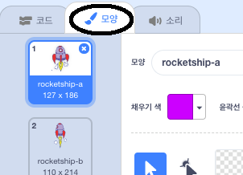
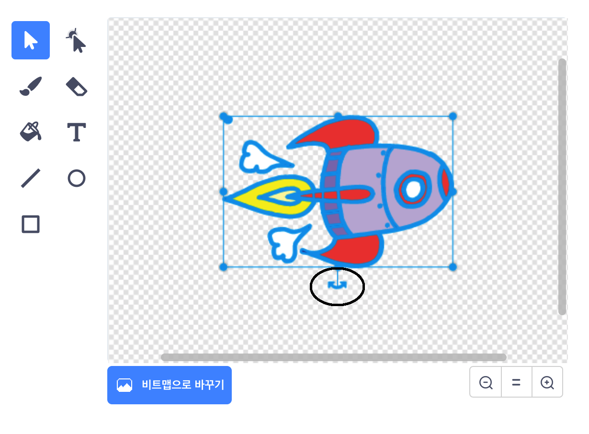

## 우주선 움직이기

첫 번째 단계로 지구쪽으로 날아가는 우주선을 만들어 봅시다!

\--- task \---

새 스크래치 프로젝트를 엽니다.

** 온라인: ** [ rpf.io/scratch-new에서 새로운 온라인 스크래치 프로젝트 열기 ](http://rpf.io/scratchon) {: target = "_ blank"}

** 오프라인: ** 오프라인 에디터에서 새 프로젝트를 엽니다.

스크래치 오프라인 에디터를 다운로드 받아야 하는 경우, [rpf.io/scratchoff](http://rpf.io/scratchoff){:target="_blank"}에서 다운 받을 수 있습니다.

\--- /task \---

\--- task \---

Add 'rocketship' and 'Earth' sprites to your Stage.


[[[generic-scratch3-sprite-from-library]]]

\--- /task \---

\--- task \---

Add the 'Stars' backdrop to your Stage.


\--- /task \---

\--- task \---

Click on your spaceship sprite, and click on the **Costumes** tab.



\--- /task \---

\--- task \---

Use the **arrow** tool to click and drag a box around the whole spaceship image. Then click on the circular **rotate** handle, and rotate the image until it is on its side.



\--- /task \---

\--- task \---

Add this code to your spaceship sprite:


```blocks3
flag 클릭했을 때
(0)도 방향 보기
x:(-150) y:(-150)로 이동하기
[Let's go]을(를) (2) 초 동안 말하기
(Earth v) 쪽 보기
(1)초 동안 x:(0) y:(0)로 이동하기
```

Change the numbers in the code blocks you've added so that the code is exactly the same as above.

\--- /task \---

If you click the green flag, you should see the spaceship speak, turn, and glide towards the centre of the stage.

