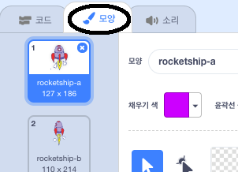
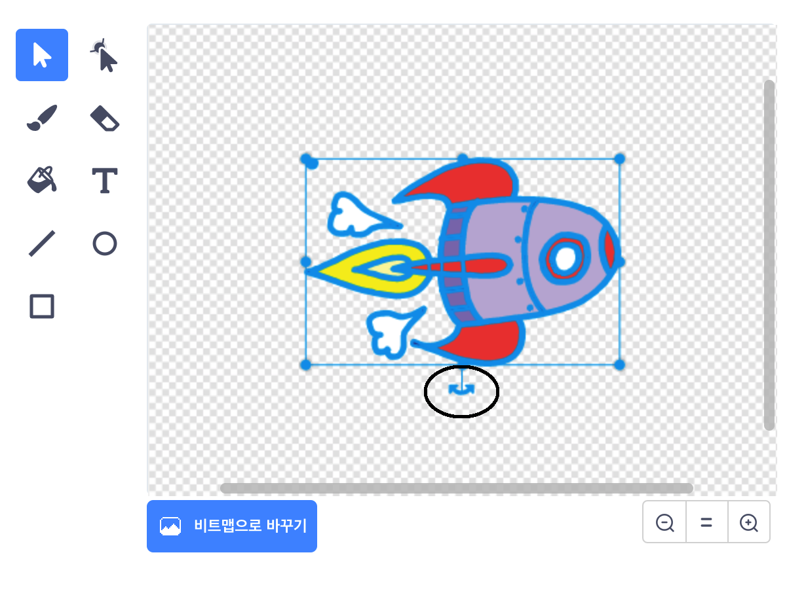
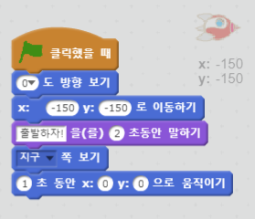

## 우주선 움직이기

지구로 날아가는 우주선을 만들어봅시다!

+ 새 스크래치 프로젝트를 열고 고양이 스프라이트를 지워서 빈 프로젝트를 만드세요. 

[[[generic-scratch-new-project]]]

+ 무대에 'Spaceship'과 'Earth' 스프라이트를 추가하세요.
    
    

[[[generic-scratch-sprite-from-library]]]

+ 무대에 '별(Stars)' 배경을 추가하세요.
    
    

[[[generic-scratch-backdrop-from-library]]]

+ 우주선 스프라이트를 클릭하고 **모양** 탭을 누르세요.
    
    

+ **화살표** 도구로 이미지를 선택하세요. 그리고 위쪽 원형 **회전** 핸들을 눌러서, 우주선이 누워있을 때까지 돌려주세요.
    
    

+ 우주선 스프라이트에 이 코드를 더해주세요:
    
    
    
    위 그림과 같게 코드블록의 숫자들을 바꿔주세요.
    
    코드 블록을 눌러서 코드를 돌려보면 우주선이 '출발하자!' 라고 말한 후 돌아서 무대 중간으로 움직이는 걸 볼 수 있습니다.
    
    

[[[generic-scratch-saving]]]

--- challenge ---

## 도전: 움직임을 자연스럽게 만들어보세요

움직임 코드에 있는 숫자를 바꿔보세요:

+ 우주선이 지구에 닿을 때 까지 움직이나요?
+ 우주선이 지구에 가까워질수록 천천히 움직이나요?

이 블록에 있는 숫자를 바꿔야 합니다:

[[[generic-scratch-coordinates]]]

--- /challenge ---