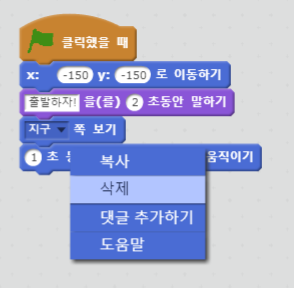
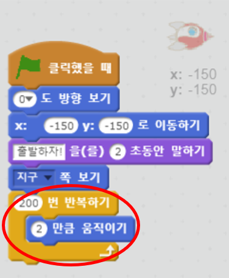

## 반복하기를 사용한 움직임

우주선을 움직이게하는 또 다른 방법은 조금씩 여러번 움직이는 것입니다.

+ 코드에서 `움직이기` 블록을 우클릭 한후 **삭제**버튼을 눌러 삭제하세요. 스크립트에서 코드를 드래그하여 코드 블록 영역으로 다시 가져 와서 코드를 삭제할 수도 있습니다.
    
    

+ ` 반복하기`를 사용해서 우주선을 지구쪽으로 움직일 수 있나요?
    
    테스트하고 저장하세요: 우주선은 이전과 똑같이 지구로 이동해야하며 이번에는 ` 반복하기` 블록을 사용합니다.
    
    

--- hints --- --- hint --- 우주선은 **움직이기** 대신에 한번에 몇단계를 **반복적으로** **움직여야 합니다**. --- /hint --- --- hint --- 필요한 코드 블록입니다:  --- /hint --- --- hint --- 우주선 움직임 코드입니다:  (`반복하기` 블록과 `움직이기` 블록안에 다른 숫자를 사용해도 우주선은 지구로 향합니다!) --- /hint --- --- /hints ---

+ 지구로 이동하는 동안 우주선의 색을 바꾸는 코드를 만들 수 있나요?
    
    테스트하고 저장하세요.
    
    

--- hints --- --- hint --- 우주선은 움직일때마다 **색을 바꿔야** 합니다. --- /hint --- --- hint --- 추가로 필요한 코드 블록입니다:  --- /hint --- --- hint --- 우주선 색을 바꾸기 위한 코드입니다:  --- /hint --- --- /hints ---

+ 우주선이 지구로 가는동안 점점 더 작아지게 만들수 있나요?
    
    테스트하고 저장하세요. 우주선은 움직이는 동안 작아집니다. 우주선 움직임을 **두 번** 테스트해보세요. 시작할 때 적당한 크기인가요?
    
    

--- hints--- --- hint--- 우주선은 **100%** 크기로 시작하고, 움직일 때마다 조금씩 **크기를 바꿔야** 합니다. --- /hint --- --- hint --- 필요한 코드 블록입니다:  --- /hint --- --- hint --- 우주선이 움직일 때마다 크기가 변화하게 만들어주는 코드입니다:  --- /hint --- --- /hints ---