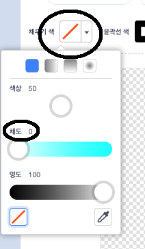

## 떠다니는 원숭이

우주에서 길을 잃은 원숭이를 더해보도록 하겠습니다!

\--- task \---

Start by adding the 'monkey' sprite from the library.


\--- /task \---

Click on your new monkey sprite and then click on **Costumes** so that you can edit how the monkey looks.

\--- task \---

Set the fill to be transparent by selecting the red line. For the outline, set a white colour by moving the Saturation slider to `0`.



\--- /task \---

\--- task \---

Click on the **circle** tool and then use it to draw a white space helmet around the monkey's head.


\--- /task \---

\--- task \---

Can you add code to your monkey sprite so that it spins slowly in a circle forever?

\--- hints \--- \--- hint \---

When the green **flag is clicked**, your monkey sprite should **turn** in a circle **forever**.

\--- /hint \--- \--- hint \---

Here are the code blocks you need:

```blocks3
무한 반복하기
끝

cw 방향으로 (15) 도 회전하기

flag 클릭했을 때
```

\--- /hint \--- \--- hint \---

Here's the code to make your monkey spin:


```blocks3
flag 클릭했을 때
무한 반복하기
    cw 방향으로 (1) 도 회전하기
```

\--- /hint \--- \--- /hints \---

\--- /task \---

Test and save your project. You'll have to click on the red **stop** button to end this animation, as it runs forever!

