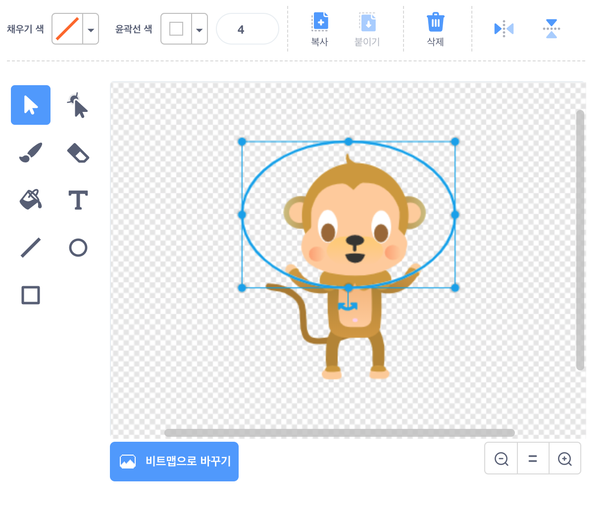
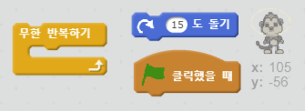
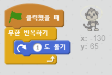

## 떠다니는 원숭이

우주에서 길을 잃은 원숭이를 더해보자!

+ 저장소에서 '원숭이(monkey)' 스프라이트를 추가합니다.
    
    

+ 새로운 원숭이 스프라이트를 누르고, **모양**을 클릭하면 원숭이 모습을 바꿀 수 있습니다. **타원** 도구를 선택한 후 원숭이 머리 주위에 하얀 우주선 헬멧을 그려줍니다.
    
    

+ 원숭이 스프라이트가 동그랗게 천천히 계속 회전하는 코드를 만들 수 있나요?
    
    프로젝트를 테스트하고 저장하세요. 빨간 **정지** 버튼을 눌러야 멈출 수 있습니다. 아니면 계속 돌아가요!
    
    

--- hints--- --- hint --- 초록 **깃발을 누르면**, 원숭이 스프라이트는 **영원히** 동그랗게 **돌아갑니다**. --- /hint --- --- hint --- 필요한 코드 블록입니다:  --- /hint --- --- hint --- 원숭이를 돌게 만드는 코드입니다:  --- /hint --- --- /hints ---