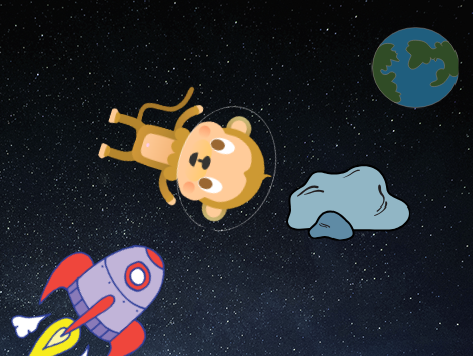

## 튀어다니는 소행성

우주에서 떠다니는 암석을 추가해봅시다.

+ 애니매이션에 '돌(rock)' 스프라이트를 추가해주세요.
    
    

+ 돌 스프라이트가 무대를 튀어다니게 만들 수 있나요?
    
    

--- hints --- --- hint --- 녹색 **깃발을 누르면** 돌 스프라이트는 **영원히** 무대를 **움직이며** **튀어다닙니다**. --- /hint --- --- hint --- 필요한 코드 블록입니다:  이 블록들 중 하나를 설정하여 더 재밌는 시작 방향을 만들 수 있습니다:  --- /hint --- --- hint --- 돌이 무대를 튀어다니게 만드는 코드입니다:  --- /hint --- --- /hints ---