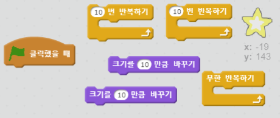
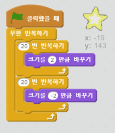

## 빛나는 별

빛나는 별을 만들기 위해 반복하기를 합쳐봅시다.

+ '별(star)' 스프라이트를 추가해주세요.
    
    

+ 별이 반복적으로 커졌다 작아지게 만들수 있나요?
    
    

--- hints--- --- hint --- 녹색 **깃발을 누르면**, 별 스프라이트는 몇 번 커지면서 **크기가 변화하고,** 몇 번 작아지면서 **크기가 변화해야합니다**. **영원히** 커지고 작아지고 반복해야합니다. --- /hint --- --- hint --- 필요한 코드 블록입니다:  --- /hint --- --- hint --- 별이 빛나게 만드는 코드입니다:  --- /hint --- --- /hints ---
