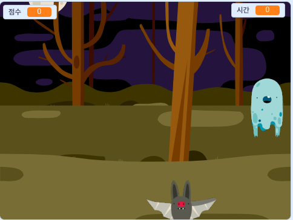

## 더 나아가기

[유령잡기](https://projects.raspberrypi.org/en/projects/ghostbusters?utm_source=pathway&utm_medium=whatnext&utm_campaign=projects) 프로젝트를 시도해보자! 이 프로젝트에선, 신출귀몰하게 나타나는 유령을 잡는 게임을 만들게 될 거야. 그리고 타이머를 추가하는 방법과 게임의 점수를 내는 방법을 배워서, 네가 얼마나 많은 유령을 잡을 수 있는지 볼 수 있을 거야.

\--- no-print \---

  <iframe allowtransparency="true" width="485" height="402" src="https://scratch.mit.edu/projects/embed/276874679/?autostart=false" frameborder="0" scrolling="no"></iframe>
  

\--- /no-print \---

\--- print-only \---

\--- /print-only \---