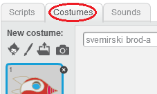
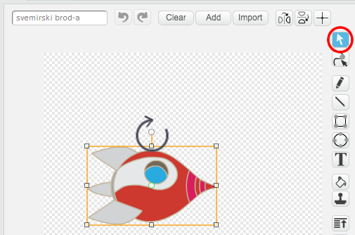
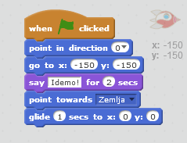

## Animacija svemirskog broda

Napravimo svemirski brod koji leti prema Zemlji!

+ Otvori novi prazan Scratch projekat.

[[[generic-scratch-new-project]]]

+ Na svoju Pozornicu (Stage) dodaj likove (sprites) 'svemirski brod' i 'Zemlja'.
    
    

[[[generic-scratch-sprite-from-library]]]

+ Na Pozornicu dodaj pozadinu (backdrop) 'Stars' (Zvijezde).
    
    

[[[generic-scratch-backdrop-from-library]]]

+ Klikni na lik svemirskog broda, a zatim klikni na karticu **Costumes** (Kostimi).
    
    

+ Koristi alatku **arrow** (strelica) da izabereš sliku. Zatim klikni na circular **rotate** handle (ručica za kružno okretanje) i okreći sliku dok ne bude okrenuta na bok.
    
    

+ Dodaj sljedeći kôd liku svemirskog broda:
    
    
    
    Izmijeni brojeve u blokovima kôda, tako da kôd bude isti kao na gornjoj slici.
    
    Ako klikneš na zelenu zastavicu, trebalo bi da vidiš svemirski brod koji govori, okreće se i klizi prema centru pozornice.
    
    

[[[generic-scratch-saving]]]

--- challenge ---

## Izazov: poboljšaj svoju animaciju

Možeš li da promijeniš brojeve u svom kôdu za animaciju, tako da se:

+ Svemirski brod kreće dok ne dodirne Zemlju?
+ Svemirski brod sporije kreće ka Zemlji?

Moraćeš da promijeniš brojeve u ovom bloku:

[[[generic-scratch-coordinates]]]

--- /challenge ---