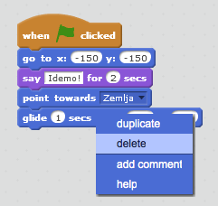
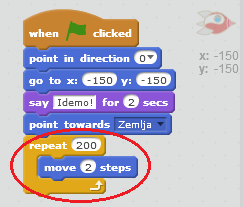
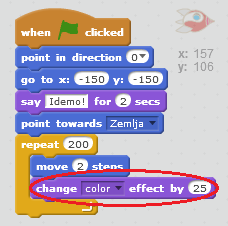
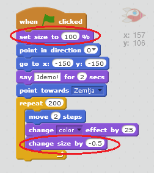

## Animacija pomoću petlji

Još jedan način da se animira svemirski brod je da mu se kaže da se kreće pomalo, ali više puta.

+ Obriši blok `glide` (klizi) iz svog kôda tako što ćeš kliknuti desnim tasterom miša na blok, a zatim kliknuti na **delete** (obriši). Takođe možeš obrisati kôd tako što ćeš ga povući van područja skripte nazad u područje blokova kôda.
    
    

+ Da li možeš da upotrijebiš blok `repeat` (ponovi) za kretanje tvog svemirskog broda ka Zemlji?
    
    Isprobaj i sačuvaj: Tvoj svemirski brod bi trebalo da se kreće ka Zemlji isto kao i ranije, ovaj put koristeći blok `repeat` (ponovi).
    
    

--- hints --- --- hint --- Umjesto da **klizi** (gliding), tvoj svemirski brod bi trebalo da se **kreće** (move) po nekoliko koraka, u **više navrata** (repeatedly). --- /hint --- --- hint --- Ovdje su blokovi kôda koji će ti biti potrebni:  --- /hint --- --- hint --- Ovo je kôd za animaciju tvog svemirskog broda:  (Možeš da koristiš različite brojeve u blokovima `repeat` (ponovi) and `move` (idi), sve dok svemirski brod još uvijek stiže do Zemlje!) --- /hint --- --- /hints ---

+ Možeš li da kodiraš svoj svemirski brod da mijenja boju dok se kreće ka Zemlji?
    
    Isprobaj i sačuvaj.
    
    

--- hints --- --- hint --- Tvoj svemirski brod treba da **mijenja boju** (change colour) dok se kreće. --- /hint --- --- hint --- Ovo je dodatni blok kôda koji će ti biti potreban:  --- /hint --- --- hint --- Ovo je kôd za promjenu boje tvog svemirskog broda:  --- /hint --- --- /hints ---

+ Da li možeš da napraviš da se tvoj svemirski brod smanji dok stigne do Zemlje?
    
    Isprobaj i sačuvaj. Tvoj svemirski brod bi trebalo da se smanjuje dok se kreće. Isprobaj svemirski brod **još jednom**. Da li ima ispravnu veličinu na početku?
    
    

--- hints --- --- hint --- Tvoj svemirski brod bi trebalo da ima **100% veličinu** (100% size) na početku, a zatim da postepeno **mijenja veličinu** (change size) dok se kreće. --- /hint --- --- hint --- Ovdje su blokovi kôda koji će ti biti potrebni:  --- /hint --- --- hint --- Ovdje je kôd za promjenu veličine svemirskog broda dok se kreće:  --- /hint --- --- /hints ---