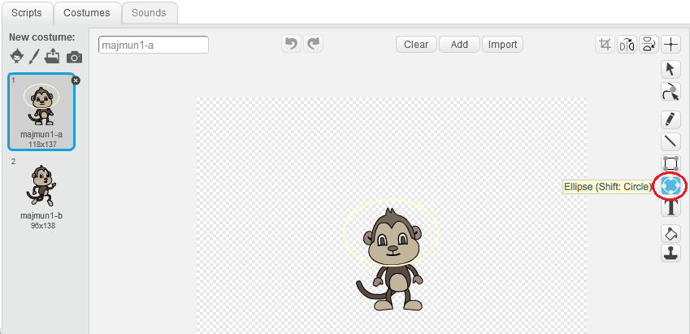

## Majmun koji pluta

Dodajmo u tvoju animaciju majmuna koji je izgubljen u svemiru!

+ Počni tako što ćeš dodati lik 'monkey' (majmun) iz biblioteke (library).
    
    

+ Ako klikneš na novi lik majmuna, a zatim klikneš na **Costumes** (Kostimi), možeš da urediš njegov izgled. Klikni na alatku **ellipse** (elipsa) i nacrtaj bijelu svemirsku kacigu oko majmunove glave.
    
    

+ Da li možeš da dodaš kôd liku majmuna tako da se neprestano polako vrti ukrug?
    
    Isprobaj i sačuvaj svoj projekat. Treba da klikneš na crveno dugme **stop** da zaustaviš animaciju, pošto se nikada ne završava!
    
    

--- hints --- --- hint --- Kada je **kliknuto na zelenu zastavicu** (flag is clicked), lik majmuna treba da se **neprestano** (forever) **okreće** (turn) ukrug. --- /hint --- --- hint --- Ovdje su blokovi kôda koji će ti biti potrebni:  --- /hint --- --- hint --- Ovdje je kôd da napraviš da se tvoj majmun okreće:  --- /hint --- --- /hints ---