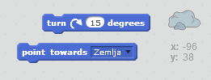
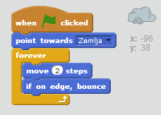

## Asteroid koji skakuće

Dodajmo plutajuću svemirsku stijenu u tvoju animaciju.

+ Dodaj lik 'rock' (stijena) u svoju animaciju.
    
    

+ Da li možeš da kodiraš lik stijene tako da skakuće po pozornici?
    
    

\--- hints \--- \--- hint \--- Kada se **klikne na zelenu zastavicu** (flag is clicked), tvoj lik stijene treba da se **kreće** (move) i **skakuće** (bounce) po pozornici **neprestano** (forever). \--- /hint \--- \--- hint \--- Ovdje su blokovi kôda koji će ti biti potrebni:  Takođe, možeš da postaviš zanimljiviji početni pravac za stijenu sa jednim od ovih blokova:  \--- /hint \--- \--- hint \--- Ovdje je kôd da napraviš da tvoja stijena skakuće po pozornici:  \--- /hint \--- \--- /hints \---