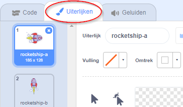
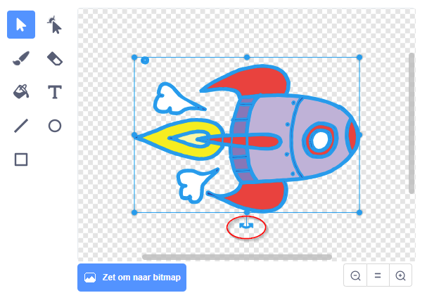
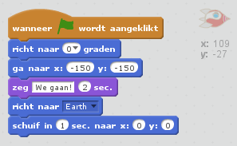

## Stap 1: een ruimteschip animeren

Laten we een ruimteschip maken dat naar de aarde vliegt!

+ Maak een nieuw leeg Scratch-project.

[[[generic-scratch-new-project]]]

+ Voeg de 'spaceship' en 'Earth'-sprites toe aan je werkgebied.
    
    

[[[generic-scratch-sprite-from-library]]]

+ Voeg de achtergrond 'Stars' toe aan je werkgebied.
    
    

[[[generic-scratch-backdrop-from-library]]]

+ Klik op de sprite van je ruimteschip en klik op de **uiterlijken** tab.
    
    

+ Gebruik het **pijl**-gereedschap om de afbeelding te selecteren. Klik dan op het **draai** hendeltje, en draai de afbeelding tot die op zijn kant ligt.
    
    

+ Voeg deze code toe aan de sprite van je ruimteschip:
    
    
    
    Wijzig de getallen in de codeblokken zodat de code exact hetzelfde is als in de bovenstaande afbeelding.
    
    Als je op de groene vlag klikt zie je het ruimteschip praten en zie je het draaien en glijden naar het midden van het speelveld.
    
    

[[[generic-scratch-saving]]]

--- challenge ---

## Uitdaging: je animatie verbeteren

Kun je de getallen in je animatiecode wijzigen, zodat:

+ Het ruimteschip beweegt totdat het de aarde raakt?
+ Het ruimteschip zich langzamer naar de aarde beweegt?

Je moet de getallen in dit blok wijzigen:

[[[generic-scratch-coordinates]]]

--- /challenge ---
