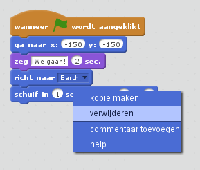
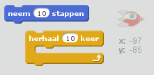
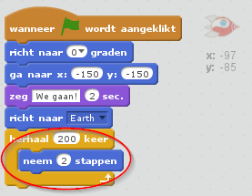
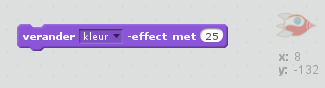
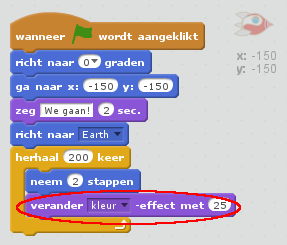
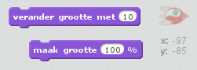
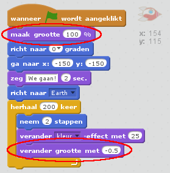

## Stap 2: Animeren met behulp van lussen

Een andere manier om het ruimteschip te bewegen is door het te vertellen dat het kleine stapjes moet zetten.

+ Verwijder het `schuif` -blok door er met de rechtermuisknop op te klikken en op **verwijderen** te klikken. Je kunt de code ook verwijderen door het uit de scriptszone naar het blokkengebied te slepen.
    
    

+ Kun je een `herhaal` -blok gebruiken om je ruimteschip naar de aarde te laten bewegen?
    
    Testen en opslaan: je ruimteschip moet naar de aarde bewegen, net als eerst, maar deze keer met een `herhaal`-blok.
    
    

--- hints --- --- hint --- In plaats van met **schuif** kun je het ruimteschip met **herhaal**- en **neem .. stappen** -blokken steeds een paar stapjes laten bewegen. --- /hint --- --- hint --- Dit zij de codeblokken die je nodig hebt:  --- /hint --- --- hint --- Zo zou je code er moeten uitzien:  (Je mag verschillende getallen gebruiken in het `herhaal` en `neem -- stappen` blok, zolang het ruimteschip maar naar de aarde gaat) --- /hint --- --- /hints ---

+ Kun je met code je ruimteschip van kleur doen veranderen terwijl het in de richting van de aarde beweegt?
    
    Testen en opslaan.
    
    

--- hints --- --- hint --- Je ruimteschip kan **van kleur veranderen** terwijl het beweegt. --- /hint --- --- hint --- Dit is het extra codeblok dat je nodig hebt:  --- /hint --- --- hint --- Dit is de code om je ruimteschip van kleur te laten veranderen:  --- /hint --- --- /hints ---

+ Kun je je ruimteschip kleiner maken als het bij de aarde komt?
    
    Test en bewaar. Je ruimteschip zou nu kleiner moeten worden als het beweegt. Test je ruimteschip een **tweede keer**. Heeft het de goede afmeting bij het begin?
    
    

--- hints --- --- hint --- Je ruimteschip zou op **100% grootte** moeten beginnen en dan met **verander grootte** kleine beetjes moeten verkleinen terwijl het beweegt. --- /hint --- --- hint --- Dit zijn de blokken code die je nodig hebt:  --- /hint --- --- hint --- Dit is de code om je ruimteschip van formaat te laten veranderen terwijl het beweegt:  --- /hint --- --- /hints ---
