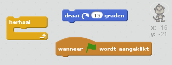
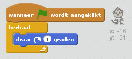

## Stap 3: Zwevende aap

Laten we een aap toevoegen die in de ruimte is verdwaald!

+ Begin met het toevoegen van de 'monkey'-sprite uit de bibliotheek.
    
    

+ Als je op de nieuwe monkey-sprite klikt en daarna op **Uiterlijken** kun je het uiterlijk van de aap aanpassen. Klik op het ** ellips **-gereedschap en teken een witte ruimtehelm om het hoofd van de aap.
    
    

+ Kun je code aan je monkey-sprite toevoegen, zodat die de hele tijd langzaam in een cirkel ronddraait?
    
    Test het en sla je project op. Je moet op de rode **stopknop** drukken om de animatie te beëindigen, want die gaat alsmaar door!
    
    

--- hints --- --- hint --- Als de **groene vlag wordt aangeklikt** zou je aap-sprite **herhaal** delijk in een rondje moeten blijven **draai** en. --- /hint --- --- hint --- Dit zij de codeblokken die je nodig hebt:  --- /hint --- --- hint --- Dit is de code om je aapje te laten draaien:  --- /hint --- --- /hints ---