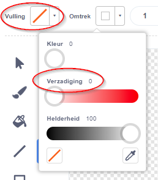

## Zwevende aap

Nu zal je aan je animatie een aap toevoegen die verdwaald is in de ruimte!

--- task --- Begin met het toevoegen van de 'Monkey'-sprite uit de bibliotheek.


--- /task ---

Klik op de nieuwe aap-sprite en daarna op **Uiterlijken** om het uiterlijk van de aap aan te passen.

--- task --- Stel een doorzichtige vulling in door de rode lijn te selecteren. Stel een witte omtrek in door de Verzadiging naar `0` te schuiven.

 --- /task ---

--- task --- Klik op het **Cirkel** gereedschap en teken er een witte ruimtehelm mee rond het hoofd van de aap.


--- /task ---

--- task --- Kan je code toevoegen aan de aap-sprite zodat die de hele tijd langzaam ronddraait?

--- hints ---
 --- hint ---

Wanneer de **groene vlag wordt aangeklikt** zou je aap-sprite **herhaal**delijk in een rondje moeten blijven **draai**en.

--- /hint --- --- hint ---

Dit zijn de codeblokken die je nodig hebt:

```blocks3
forever
end

turn cw (15) degrees

when flag clicked
```

--- /hint --- --- hint ---

Dit is de code om je aap te laten ronddraaien:


```blocks3
when flag clicked
forever
    turn cw (1) degrees
```

--- /hint --- --- /hints ---

--- /task ---

Test en bewaar je project. Je moet op de rode **stop**-knop drukken om de animatie te beëindigen, want die blijft maar doorgaan!

