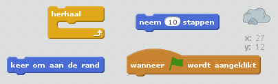
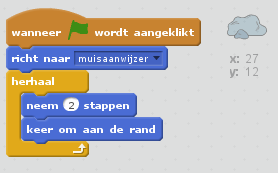

## Stap 4: Stuiterende asteroïde

Laten we wat zwevend ruimtesteen toevoegen aan je animatie.

+ Voeg een 'rock'-sprite toe aan je animatie.
    
    

+ Kun je je rots-sprite zo programmeren dat die door het speelveld stuitert?
    
    

--- hints --- --- hint --- Als de **groene vlag is aangeklikt** zou de rots-sprite **stappen moeten nemen** en **herhaal** delijk moeten **omkeren aan de rand** van het speelveld. --- /hint --- --- hint --- Dit is de code die je nodig hebt:  Je kunt een interessantere manier gebruiken om de richting van de rots te bepalen met deze blokken: --- /hint --- --- hint --- Dit is de code om de rots in het speelveld rond te laten stuiteren:  --- /hint --- --- /hints ---