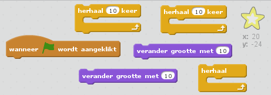
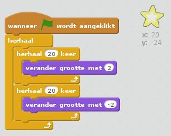

## Stap 5: Fonkelende ster

Laten we lussen bij elkaar brengen om een ​fonkelende ster te maken.

+ Voeg een 'star'-sprite toe aan je animatie.
    
    

+ Kun je de ster zo programmeren dat die de hele tijd groter en kleiner wordt?
    
    

--- hints --- --- hint --- Als de **groene vlag wordt aangeklikt** kun je een paar keer met **verander grootte met** de ster groter maken en met **verander grootte met** die ook weer kleiner maken. De ster zou met **herhaal** voor altijd moeten groeien en krimpen. --- /hint --- --- hint --- Dit zijn de blokken die je nodig hebt:  --- /hint --- --- hint --- Dit is het programma waarmee je de ster kunt laten fonkelen:  --- /hint --- --- /hints ---