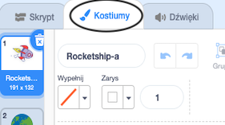
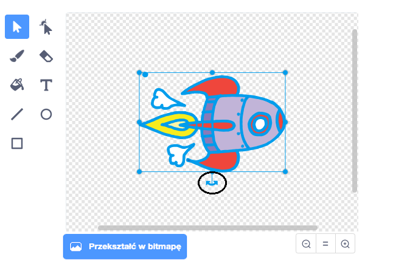

## Animowanie statku kosmicznego

Pierwszym krokiem będzie stworzenie statku kosmicznego lecącego w kierunku Ziemi!

--- task ---

Otwórz nowy projekt Scratch.

**Online:** otwórz nowy projekt Scratcha na stronie [rpf.io/scratch-new](http://rpf.io/scratchon){:target="_blank"}.

**Offline:** otwórz nowy projekt w edytorze offline.

Jeśli musisz pobrać i zainstalować edytor Scratcha, znajdziesz go na stronie [rpf.io/scratchoff](http://rpf.io/scratchoff){:target="_blank"}.

--- /task ---

--- task --- Dodaj duszki "Rakieta" (ang. Rocketship) i "Ziemia" (ang. Earth) do swojej Sceny.


[[[generic-scratch3-sprite-from-library]]]

--- /task ---

--- task --- Dodaj tło "Stars" do swojej Sceny.


--- /task ---

--- task --- Kliknij na duszka statku kosmicznego i kliknij na zakładkę **Kostiumy**.



--- /task ---

--- task --- Użyj narzędzia **strzałka**, aby kliknąć i przeciągnąć okno wokół całego obrazu statku kosmicznego. Następnie kliknij okrągły uchwyt **obróć** i obróć obraz, aż znajdzie się na boku.



--- /task ---

--- task --- Dodaj ten kod do swojego duszka statku kosmicznego:


```blocks3
kiedy flaga kliknięta
ustaw kierunek na (0)
idź do x: (- 150) y: (- 150)
powiedz [Chodźmy] przez (2) sekundy
ustaw w kierunku duszka (Ziemia v)
leć przez (1) sekund do x: (0) y: (0)
```

Zmień liczby w dodanych blokach kodu, aby kod był dokładnie taki sam jak powyżej.

--- /task ---

Jeśli klikniesz zieloną flagę, powinieneś zobaczyć, jak statek kosmiczny mówi, skręca i leci w kierunku środka sceny.

