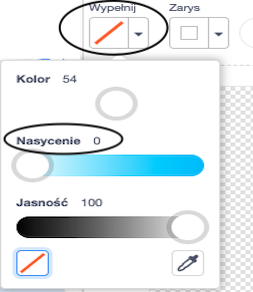
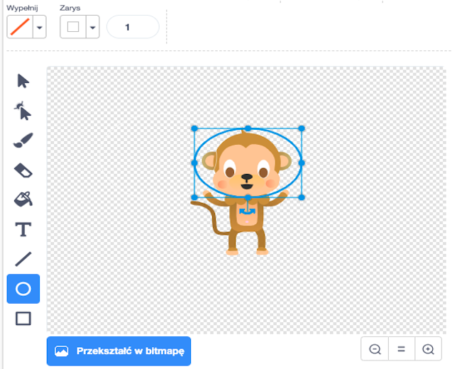

## Pływająca małpa

Teraz dodamy małpę, która zaginęła w kosmosie do twojej animacji!

\--- task \--- Zacznij od dodania duszka "małpa" (ang. Monkey) z biblioteki.


\--- /task \---

Kliknij na swój nowy duszek małpy, a następnie kliknij **Kostiumy** , aby móc edytować wygląd małpy.

\--- task \--- Ustawić wypełnienie jako przezroczyste, wybierając czerwoną linię. W przypadku konturu ustaw biały kolor, przesuwając suwak Nasycenie w położenie `0`.

 \--- /task \---

\--- task \--- Kliknij narzędzie **okrąg**, a następnie użyj go do narysowania białego hełmu wokół głowy małpy.



\--- /task \---

\--- task \--- Czy możesz dodać kod do swojego duszka małpy, tak aby cały czas obracała się powoli w koło?

\--- hints \--- \--- hint \---

Gdy zielona **flaga jest kliknięta**, twój duszek małpy powinien **obracać się** w kółko **ciągle**.

-- /hint \--- \--- hint \---

Oto potrzebne bloki kodu:

```blocks3
na zawsze
koniec

obróć cw (15) stopni

kiedy flaga kliknięta
```

-- /hint \--- \--- hint \---

Oto kod, który sprawi, że twoja małpa się zakręci:


```blocks3
kiedy flaga kliknęta
na zawsze
    obróć cw (1) stopni
```

\--- /hint \--- \--- /hints \---

\--- /task \---

Przetestuj i zapisz swój projekt. Będziesz musiał kliknąć czerwony przycisk **zatrzymaj**, aby zakończyć tę animację, ponieważ działa ona wiecznie!

