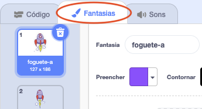

## Animando uma nave espacial

Seu primeiro passo será criar uma nave espacial que voa em direção à Terra!

--- task ---

Abra um novo projeto Scratch.

**Online:** abra um novo projeto Scratch online no link: [rpf.io/scratch-new](http://rpf.io/scratchon){:target="_blank"}.

**Offline:** abra um novo projeto no editor offline.

Se você precisar baixar e instalar o editor offline do Scratch, poderá encontrá-lo em [rpf.io/scratchoff](http://rpf.io/scratchoff){:target="_blank"}.

--- /task ---

--- task ---

Adicione os atores 'Rocketship' (nave espacial) e 'Earth' (Terra) para o seu Palco.


[[[generic-scratch3-sprite-from-library]]]

--- /task ---

--- task ---

Adicione o pano de fundo 'Stars' (Estrelas) ao seu Palco.


--- /task ---

--- task ---

Clique no seu ator da nave espacial e clique na aba **Fantasias**.



--- /task ---

--- task ---

Use a ferramenta **seta** para clicar e arrastar a caixa ao redor de toda a imagem da nave espacial. Em seguida, clique na **alça de rotação**, e gire a imagem até que ela fique de lado.


--- /task ---

--- task ---

Adicione este código ao seu ator 'Nave espacial':


```blocks3
when flag clicked
point in direction (0)
go to x:(-150) y:(-150)
say [Vamos lá] for (2) seconds
point towards (Earth v)
glide (1) secs to x:(0) y:(0)
```

Altere os números nos blocos de código que você adicionou para que o código seja exatamente o mesmo que acima.

--- /task ---

Se você clicar na bandeira verde, você deve ver a nave espacial falar, virar e deslizar em direção ao centro do cenário.

