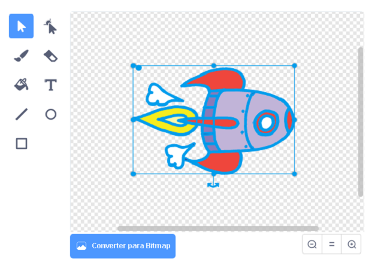

## Animando uma nave espacial

Seu primeiro passo será criar uma nave espacial que voa em direção à Terra!

\--- task \---

Abra um projeto novo Scratch.

**Online:** abra um novo projeto Scratc online no link: [rpf.io/scratch-new](http://rpf.io/scratchon){:target="_blank"}.

**Offline:** abra um novo projeto no editor offline.

Se você precisar baixar e instalar o editor offline do Scratch, poderá encontrá-lo em [rpf.io/scratchoff](http://rpf.io/scratchoff){:target="_blank"}.

\--- /task \---

\--- task \--- Adicione os sprites 'nave espacial' e 'Terra' para o seu Cenário.


[[[generic-scratch3-sprite-from-library]]]

\--- /task \---

\--- task \--- Adiciona a imagem de fundo 'Estrelas' ao seu Cenário.


\--- /task \---

\--- task \--- Clique no seu sprite da nave espacial e clique na aba **Costumes**.


\--- /task \---

\--- task \--- Use a **seta** para clicar e arrastar uma caixa ao redor de toda a imagem da nave espacial. Em seguida clique no círculo de **rotação** e rotacione a imagem até que ela esteja de lado.



\--- /task \---

\--- task \--- Adicione esse código ao sprite da sua nave espacial:


```blocks3
when flag clicked
point in direction (0)
go to x:(-150) y:(-150)
say [Let's go] for (2) seconds
point towards (Earth v)
glide (1) secs to x:(0) y:(0)
```

Altere os números nos blocos de código que você adicionou para que o código seja exatamente o mesmo que acima.

\--- /task \---

Se você clicar na bandeira verde, você deve ver a nave espacial falar "Vamos lá!", virar e deslizar em direção ao centro do palco.

