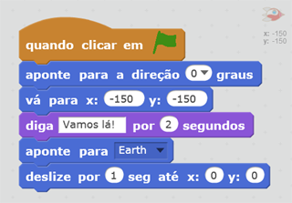

## Animando uma nave espacial

Vamos fazer uma nave espacial que voe em direção à Terra!

+ Abra um novo projeto Scratch vazio.

[[[generic-scratch-new-project]]]

+ Adicione os atores 'Spaceship' e 'Earth' ao seu Palco.
    
    

[[[generic-scratch-sprite-from-library]]]

+ Adicione o pano de fundo 'stars' ao seu Palco.
    
    

[[[generic-scratch-backdrop-from-library]]]

+ Clique no seu ator 'Spaceship' e clique na aba **Fantasias**.
    
    

+ Use a ferramenta **seta** para selecionar a imagem. Em seguida, clique na **alça de rotação** manuseie e gire a imagem até que ela fique de lado.
    
    

+ Adicione este código ao seu ator 'Spaceship':
    
    
    
    Altere os números nos blocos de código, de modo que o código fique exatamente igual à imagem acima.
    
    Se você clicar na bandeira verde, você deve ver a nave espacial falar "Vamos lá!", virar e deslizar em direção ao centro do palco.
    
    

[[[generic-scratch-saving]]]

--- challenge ---

## Desafio: Melhorar a sua animação

Você pode alterar os números no seu código de animação, de modo que:

+ A nave espacial se mova até tocar a Terra?
+ A nave espacial se mova mais devagar em direção à Terra?

Você precisará alterar os números neste bloco:

[[[generic-scratch-coordinates]]]

--- /challenge ---