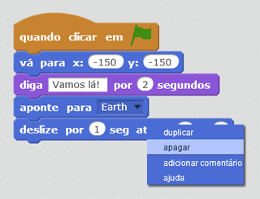
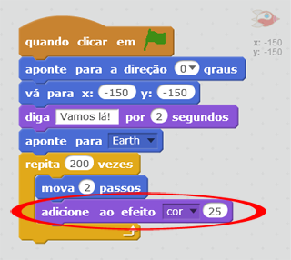
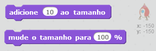
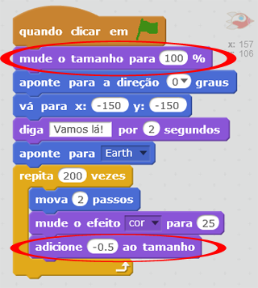

## Animando usando repetições

Outra maneira de animar a nave espacial é dizer para ela se mover uma pequena distância várias vezes.

+ Apagar o bloco `deslizar` do seu código, clicando com o botão direito do mouse sobre ele e clicando em **apagar**. Você também pode apagar o código arrastando-o de volta para a área de blocos de código.
    
    

+ Você pode usar um bloco de código `repita` para mover sua nave espacial em direção à Terra?
    
    Teste e salve: sua nave espacial deve se mover em direção à Terra exatamente como antes, desta vez usando um bloco de comando de repetição `repita`.
    
    

\--- hints \--- \--- hint \--- Em vez de **deslizar**, sua nave espacial deve se **movimentar** alguns passos de cada vez **repetidamente**. \--- / hint \--- \--- hint \--- Aqui estão os blocos de código que você vai precisar: <0 /> \--- / hint \--- \--- hint \--- Aqui está o código para animar a sua nave espacial: <1 /> (Você pode usar números diferentes de repetição no bloco de código `repita` e `mova`, contanto que a nave espacial ainda chegue à Terra!) \--- / hint \--- \--- / hints \---

+ Você consegue programar a sua nave espacial para mudar de cor enquanto ela se move em direção à Terra?
    
    Teste e salve.
    
    

\--- hints \--- \--- hint \--- Sua nave espacial pode **mudar de cor** enquanto se move. \--- /hint \--- \--- hint \--- Aqui está o bloco de código que você precisará:  \--- /hint \--- \--- hint \--- Este é o código para mudar a cor da sua nave espacial:  \--- /hint \--- \--- /hints \---

+ Você consegue fazer a sua nave espacial ficar menor à medida que se move em direção à Terra?
    
    Testar e salvar. Sua nave espacial deve ficar menor enquanto ela se move em direção à Terra. Teste sua nave espacial uma **segunda vez**. Ela está do tamanho certo quando começa a animação?
    
    

\--- hints \--- \--- hint \--- Your spaceship should start at **100% size**, and then **change size** by a small amount as it moves. \--- /hint \--- \--- hint \--- Here is the code blocks you'll need:  \--- /hint \--- \--- hint \--- Here's the code to change your spaceship's size as it moves:  \--- /hint \--- \--- /hints \---