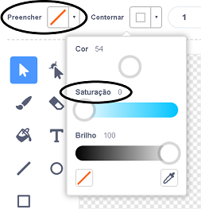

## Macaco flutuante

Agora você vai adicionar um macaco perdido no espaço na sua animação!

--- task ---

Comece adicionando o ator 'monkey' (macaco) da biblioteca.


--- /task ---

Clique no seu novo ator de macaco e depois clique em **Fantasias** para que você possa editar a aparência do macaco.

--- task ---

Defina o preenchimento para transparente, selecionando a linha vermelha. Para o contorno, defina uma cor branca movendo o controle deslizante de saturação para `0`.



--- /task ---

--- task ---

Clique na ferramenta **círculo** e use-a para desenhar um capacete de espaço branco em torno da cabeça do macaco.


--- /task ---

--- task ---

Você consegue adicionar blocos de código ao seu ator macaco para que ele gire lentamente em círculos para sempre?

--- hints ---
 --- hint ---

Quando a **bandeira verde é clicada**, o seu ator de macaco deve **girar** em círculo **para sempre**.

--- /hint --- --- hint ---

Aqui estão os blocos de código que você precisa:

```blocks3
sempre
end

gire ↻ (15) graus

quando ⚑ for clicado
```

--- /hint --- --- hint ---

Aqui está o código para fazer seu macaco girar:


```blocks3
quando ⚑ for clicado
sempre 
  gire ↻ (1) graus
end
```

--- /hint ------ /hints ---

--- /task ---

Teste e salve seu projeto. Você terá que clicar no botão vermelho de **parar** para parar esta animação, pois ela é executada para sempre!

