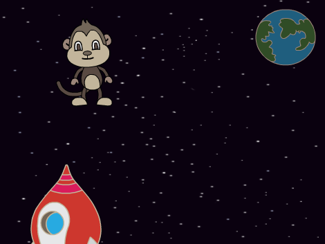
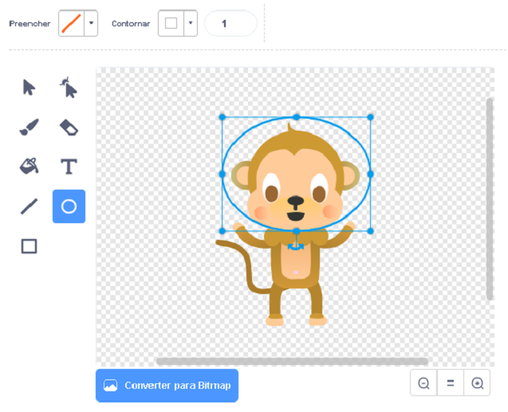
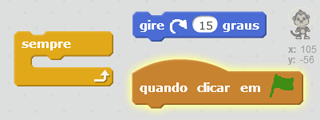
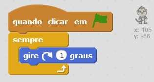

## Macaco flutuante

Vamos adicionar um macaco que está perdido no espaço a sua animação!

+ Comece adicionando o ator 'Monkey1' da biblioteca.
    
    

+ Se você clicar no seu novo ator, o macaco, e depois clicar em **Fantasias**, você poderá editar o visual dele. Clique na ferramenta **Elipse** e desenhe um capacete espacial branco em volta da cabeça do macaco.
    
    

+ Você consegue adicionar blocos de código ao seu macaco ator para que ele gire lentamente em círculos para sempre?
    
    Teste e salve seu projeto. Você terá que clicar no botão vermelho **Pare** para terminar esta animação, senão ela continuará para sempre!
    
    

--- hints --- --- hint --- Quando a **bandeira verde é clicada**, o macaco deve **girar** em círculo **para sempre**. --- /hint --- --- hint --- Aqui estão os blocos de código que você vai precisar:  --- /hint --- --- hint --- Aqui estão os blocos de código que farão o seu macaco girar:  --- /hint --- --- /hints ---