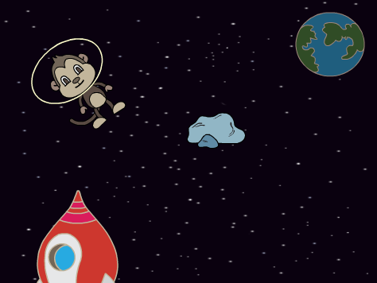
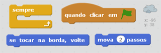
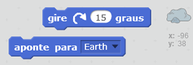

## Asteroide viajante

Vamos adicionar um asteroide à sua animação.

+ Adicione um ator 'Rock' à sua animação.
    
    

+ Você consegue programar seu ator 'Rock' para ser um asteroide que fique viajando pelo seu palco?
    
    

--- hints --- --- hint --- Quando a **bandeira verde é clicada**, o asteroide deve se **mover** e **viajar** em seu palco **para sempre**. --- /hint --- --- hint --- Aqui estão os blocos de código que você vai precisar:  Você também pode definir uma direção de partida mais interessante para o asteroide com um desses blocos de código:  --- /hint --- --- hint --- Aqui estão os blocos de código para o seu asteroide viajar ao redor do palco:  --- /hint --- --- /hints ---
