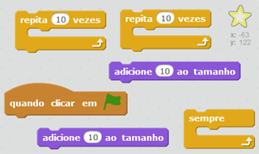
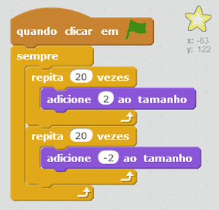

## Estrela brilhante

Vamos combinar repetições para fazer uma estrela brilhante.

+ Adicione um ator 'Star1' à sua animação.
    
    

+ Você consegue codificar sua estrela para ela aumentar e diminuir de tamanho repetidamente?
    
    

\--- hints \--- \--- hint \--- When the green **flag is clicked**, your star sprite should **change size** to get bigger a few times, and then **change size** to get smaller a few times. It should do this so that it grows and then shrinks **forever**. \--- /hint \--- \--- hint \--- Here are the code blocks you'll need:  \--- /hint \--- \--- hint \--- Here's the code to make your star shine:  \--- /hint \--- \--- /hints \---