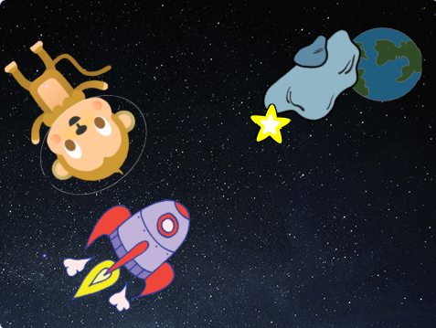

## Estrela brilhante

Agora você combinará loops para formar uma estrela brilhante.

\--- task \--- Acrescenta um ator 'estrela' à sua animação.



\--- /task \---

\--- task \--- Você consegue adicionar o código ao seu ator de estrela para fazer com que a estrela cresça e encolha repetidamente?


\--- hints \--- \--- hint \--- Quando a **bandeira verde é clicada**, sua estrela deve **mudar de tamanho** aumentando algumas vezes e em seguida, **alterar o tamanho** novamente, ficando menor. Isso deve ser feito para que fique maior e menor ** para sempre ** e pareça que está brilhando. \--- /hint \--- \--- hint \--- Aqui estão os blocos que você vai precisar:

```blocks3
repete (10) vezes
end

Quando alguém clicar na bandeira verde

repete (10) vezes
end

adiciona (10) ao teu tamanho

adiciona (10) ao teu tamanho

repete para sempre
```

\--- /hint \--- \--- hint \--- Aqui está o código para fazer a sua estrela crescer e encolher: 

```blocks3
quando alguém clicar na bandeira verde
repete para sempre 
  repete (20) vezes 
    adiciona (2) ao seu tamanho
  end
  repete (20) vezes 
    adiciona (-2) ao seu tamanho
  end

```

\--- /hint \--- \--- /hints \--- \--- /task \---