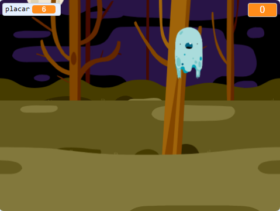

## E agora?

Experimente o projeto [Ghostbusters](https://projects.raspberrypi.org/en/projects/ghostbusters?utm_source=pathway&utm_medium=whatnext&utm_campaign=projects)! Nesse projeto, você aprenderá como criar um jogo com fantasmas que aparecem por aí e você precisa capturar eles. Você também aprenderá como adicionar um cronômetro e uma pontuação ao jogo para poder ver quantos fantasmas você conseguiu capturar.

\--- no-print \---

  <iframe allowtransparency="true" width="485" height="402" src="https://scratch.mit.edu/projects/embed/276874679/?autostart=false" frameborder="0" scrolling="no"></iframe>
  

\--- /no-print \---

\--- print-only \---

\--- /print-only \---