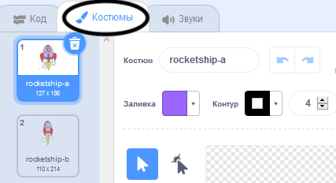
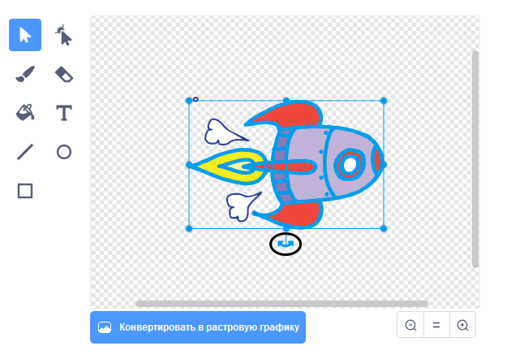

## Анимация космического корабля

Твоим первым шагом будет создание космического корабля, который летит к Земле!

--- task ---

Открой новый проект Scratch.

**Онлайн:** открой новый онлайн проект Scratch [rpf.io/scratch-new](http://rpf.io/scratchon){:target="_blank"}.

**Оффлайн:** открой новый проект в автономном редакторе.

Если тебе нужно скачать и установить автономный редактор Scratch, ты можешь найти его по адресу [rpf.io/scratchoff](http://rpf.io/scratchoff){:target="_blank"}.

--- /task ---

--- task --- Добавь спрайты 'ракета' и 'Земля' на свою Сцену.


[[[generic-scratch3-sprite-from-library]]]

--- /task ---

--- task --- Добавь фон «Звёзды» на свою Сцену.


--- /task ---

--- task --- Нажми на спрайт своего космического корабля и перейди на вкладку **Костюмы**.



--- /task ---

--- task --- С помощью инструмента **стрелка** щелкни и перетащи рамку вокруг всего изображения космического корабля. Затем нажми на закругленную ручку **поворот** и поверни изображение, пока оно не будет в нужном направлении.



--- /task ---

--- task --- Добавь этот код к своему спрайту космический корабль:


```blocks3
когда щёлкнут по зелёному флагу
повернуться в направлении (0)
перейти в x: (-150) y: (-150)
говорить [Поехали] (2) секунд
повернуться к (Земля v)
плыть (1) секунд в точку x: (0) y: (0)
```

Измени числа в блоках кода, которые ты добавил, чтобы код был точно таким же, как указано выше.

--- /task ---

Если ты нажмешь на зеленый флаг, то увидишь, что космический корабль говорит, поворачивается и плывёт к центру сцены.

