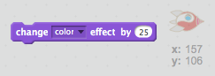

## Анимация с использованием петель

Другой способ оживить космический корабль - сказать ему, чтобы он перемещал небольшое количество много раз.

+ Удалите блок `glide` из вашего кода, щелкнув его правой кнопкой мыши и нажав **delete**. Вы также можете удалить код, перетащив его из области «Сценарий» и обратно в область «Кодовые блоки».
    
    

+ Можете ли вы использовать блок `повтора` для перемещения вашего корабля к Земле?
    
    Тестируйте и сохраняйте: ваш космический корабль должен двигаться в направлении Земли точно так же, как и раньше, на этот раз с использованием блока `повторений`.
    
    

\--- hints \--- \--- hint \--- Вместо **скользящих**, ваш космический корабль должен **раза** **двигаться** за несколько шагов за раз. \--- / hint \--- \--- hint \--- Вот коды, которые вам понадобятся:  \--- / hint \--- \--- hint \--- Вот код для анимации вашего космического корабля:  (Вы можете использовать разные цифры в `повторах` и `перемещать` блоков, пока космический корабль все еще попадает на Землю!) \--- / hint \--- \--- / подсказки \---

+ Можете ли вы закодировать свой космический корабль, чтобы изменить цвет, когда он движется к Земле?
    
    Проверьте и сохраните.
    
    

\--- hints \--- \--- hint \--- Ваш космический корабль должен **изменить цвет** при его движении. \--- / hint \--- \--- hint \--- Вот дополнительный код, который вам понадобится:  \--- / hint \--- \--- hint \--- Вот код, чтобы изменить цвет вашего космического корабля:  \--- / hint \--- \--- / hints \---

+ Можете ли вы сделать свой космический корабль меньше, когда он доберется до Земли?
    
    Проверьте и сохраните. Ваш космический корабль должен уменьшаться по мере его перемещения. Проверяйте свой космический корабль **секунд**. Правильный размер, когда он начинается?
    
    

\--- подсказки \--- \--- подсказка \--- Ваш космический корабль должен начинаться с **100% размера**, а затем **менять размер** на небольшую сумму при движении. \--- / hint \--- \--- hint \--- Вот коды, которые вам понадобятся:  \--- / hint \--- \--- hint \--- Вот код изменить размер вашего космического корабля при его движении:  \--- / hint \--- \--- / hints \---