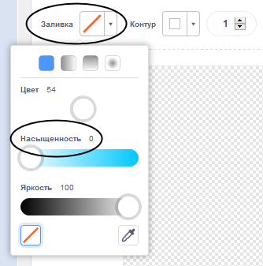
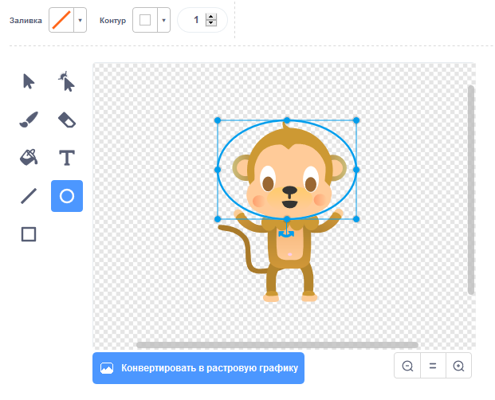

## Плавающая обезьяна

Теперь ты добавишь к своей анимации обезьяну, которая потерялась в космосе!

\--- задача \--- Начни с добавления спрайта 'обезьяна' из библиотеки.


\--- / задача \---

Нажмите на свой новый спрайт обезьяны и затем нажмите **Костюмов** чтобы вы могли редактировать, как выглядит обезьяна.

\--- задача \--- Установите заливку прозрачной, выделив красную линию. Для контура установите белый цвет, переместив ползунок Насыщенность в `0`.

 \--- / задача \---

\--- task \--- Нажмите на инструмент **circle** и затем используйте его, чтобы нарисовать белый космический шлем вокруг головы обезьяны



\--- / задача \---

\--- задача \--- Можете ли вы добавить код к вашему спрайту обезьяны, чтобы он медленно вращался по кругу навсегда?

\--- подсказки \--- \--- подсказка \---

Когда зеленый флажок **нажимается**, ваш спрайт обезьяны должен **повернуть** по кругу **навсегда**.

\--- / подсказка \--- \--- подсказка \---

Вот блоки кода, которые вам нужны:

```blocks3
навсегда
конец

поворот cw (15) градусов

при нажатии флага
```

\--- / подсказка \--- \--- подсказка \---

Вот код, который заставит вашу обезьяну вращаться:


```blocks3
когда флаг нажал
навсегда
    поворот cw (1) градусов
```

\--- / подсказка \--- \--- / подсказка \---

\--- / задача \---

Протестируйте и сохраните ваш проект. Вы должны нажать на красную **Остановка** кнопку , чтобы закончить эту анимацию, как это работает навсегда!

