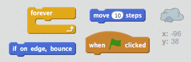

## Отскок астероида

Давайте добавим немного плавающего космического камня в вашу анимацию.

+ Добавьте в анимацию «рок» спрайт.
    
    

+ Можете ли вы закодировать свой рок-спрайт, чтобы подпрыгнуть вокруг сцены?
    
    

\--- hints \--- \--- hint \--- При нажатии на зеленый флаг ****, ваш скальный спрайт должен **двигаться** и **отскок** вокруг этапа **навсегда**. \--- / hint \--- \--- hint \--- Вот коды, которые вам понадобятся:  Вы также можете установить более интересное начальное направление для скалы с одним из этих блоков:  \--- / hint \--- \--- hint \--- Вот код для отскока скалы вокруг сцены:  \--- / hint \--- \--- / hints \---