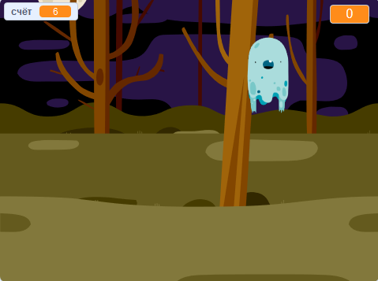

## Что дальше?

Попробуй проект [Охотники за приведениями](https://projects.raspberrypi.org/en/projects/ghostbusters?utm_source=pathway&utm_medium=whatnext&utm_campaign=projects)! В этом проекте ты узнаешь, как создать игру с призраками, которые появляются повсюду и которые тебе нужно поймать. Ты также узнаешь, как добавить в игру таймер и счёт, чтобы увидеть, сколько призраков ты сможешь поймать.

\--- no-print \---

  <iframe allowtransparency="true" width="485" height="402" src="https://scratch.mit.edu/projects/embed/276874679/?autostart=false" frameborder="0" scrolling="no"></iframe>
  

\--- /no-print \---

\--- print-only \---

\--- /print-only \---