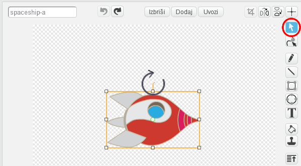

## Animacija vesoljske ladje

Tvoj prvi korak bo ustvarjanje rakete, ki leti proti Zemlji!

\--- task \---

Ustvari nov Scratch projekt.

**S povezavo:** ustvari nov spletni Scratch projekt na [rpf.io/scratch-new](http://rpf.io/scratchon){:target="_blank"}.

**Brez povezave:** ustvari nov projekt v namiznem Scratch urejevalniku.

Če želiš prenesti in namestiti Namizni Scratch, ga lahko najdeš na [rpf.io/scratchoff](http://rpf.io/scratchoff){: target = "_ blank"}.

\--- /task \---

\--- task \--- Dodaj figuri 'rocketship' in 'Earth' na svoj oder in ju preimenuj v 'raketa' in 'Zemlja'.


[[[generic-scratch3-sprite-from-library]]]

\--- /task \---

\--- task \--- Odru dodaj ozadje 'Stars' in ga preimenuj v 'zvezde'.


\--- /task \---

\--- task \--- Click on your spaceship sprite, and click on the **Costumes** tab.


\--- /task \---

\--- task \--- Uporabi orodje **puščico**, da klikneš in potegneš pravokotnik okoli slike celotne rakete. Nato klikni na ročaj za **vrtenje** in zasuči sliko, dokler ni obrnjena položno.



\--- /task \---

\--- task \--- Figuri rakete dodaj sledečo kodo:


```blocks3
ko kliknemo na zastavico
obrni se v smer (0)
pojdi na x:(150) y:(150)
reci [Pojdimo!] za (2) sekund
obrni se proti (Zemlja)
drsi (1) sekund do x:(0) y:(0)
```

Spremeni številke v blokih kode, ki si jih dodal, da bodo povsem enake kot zgoraj.

\--- /task \---

Če klikneš zeleno zastavo, bi morali vesoljska ladja spregovoriti, se obrniti in nato oddrseti proti sredini odra.

