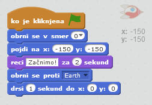

## Animating a spaceship

Naredimo vesoljsko ladjo, ki leti proti Zemlji!

+ Odprite nov prazen Scratch projekt.

[[[generic-scratch-new-project]]]

+ Dodajte figuri 'spaceship' in 'Earth'.
    
    

[[[generic-scratch-sprite-from-library]]]

+ Dodajte ozadje 'stars'.
    
    

[[[generic-scratch-backdrop-from-library]]]

+ Kliknite na figuro 'spaceship' in zavihek **Videzi**.
    
    

+ Izberite sliko s pomočjo orodja **izberi** in nato kliknite na krog **za rotacijo** in zavrtite sliko za 90°.
    
    

+ Dodajte to kodo v svojo figuro:
    
    
    
    Spremenite številke v blokih, tako da bo koda popolnoma enaka, kot na zgornji sliki.
    
    Če kliknete zeleno zastavo, bi morali vesoljska ladja govoriti, se obrniti in nato drseti proti sredini odra.
    
    

[[[generic-scratch-saving]]]

\--- challenge \---

## Izziv: Izboljšanje animacije

Ali lahko spremenite številke v svoji kodi animacije, tako da se:

+ Vesoljska ladja premika, dokler se ne dotakne Zemlje?
+ Vesoljska ladja počasi premika proti Zemlji?

Številke boste morali spremeniti v tem bloku:

[[[generic-scratch-coordinates]]]

\--- /challenge \---