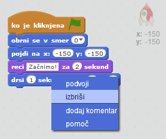
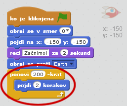
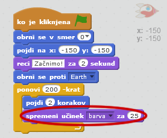
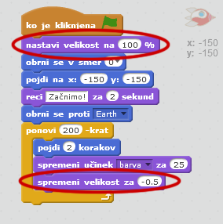

## 2. korak: Animiranje z zankami

Drug način za animacijo vesoljske ladje je z uporabo zank. Tako lahko vesoljsko ladjo premaknete večkrat zapored.

+ Odstranite `blok za drsenje`, tako da z desno miškino tipko kliknete na blok in nato **izbriši**. Blok lahko izbrišete tudi tako, da ga povlečete nazaj na območje neuporabljenih blokov.
    
    

+ Ali lahko uporabite blok `ponavljaj` za premikanje vesoljske ladje k ​​Zemlji?
    
    Preizkusite in shranite: Vaša vesoljska ladja bi se morala premikati proti Zemlji, z blokom `ponavljaj`.
    
    

\--- hints \--- \--- hint \--- Namesto **drsenja</0 > bi se morala vaša vesoljska ladja **večkrat** zaporedno **premikati** nekaj korakov naenkrat. \--- /hint \--- \--- hint \--- Potrebovali boste naslednje bloke:  \--- /hint \--- \--- hint \--- Tukaj je koda za animacijo vesoljske ladje:  (V blokih `ponavljaj` in `pojdi` lahko uporabite tudi druge številke!) \--- /hint \--- \--- /hints \---
 

+ Lahko naredite, da bo vesoljska ladja spreminjala barve, medtem ko se bo premikala proti Zemlji?
    
    Preizkusite in shranite.
    
    

\--- hints \--- \--- hint \--- Vesoljska ladja bi morala **spreminjati barvo**, medtem ko se premika. \--- /hint \--- \--- hint \--- Potrebovali boste naslednji blok:  \--- /hint \--- \--- hint \--- Tukaj je koda za spreminjanje barve vesoljske ladje:  \--- /hint \--- \--- /hints \---

+ Lahko naredite svojo vesoljsko ladjo manjšo, ko pride do Zemlje?
    
    Preizkusite in shranite. Vaša vesoljska ladja bi se morala pomanjšati med premikanjem Preizkusite **ponovno**. Ali ima vesoljska ladja na začetku pravilno velikost?
    
    

\--- hints \--- \--- hint \--- Vaša vesoljska ladja bo na začetku imela **100% velikost**, nato pa se bo med premikanjem **zmanjševala**. \--- /hint \--- \--- hint \--- Potrebovali boste naslednje bloke:  \--- /hint \--- \--- hint \--- Tukaj je koda za pomanjševanje vesoljske ladje:  \--- /hint \--- \--- /hints \---