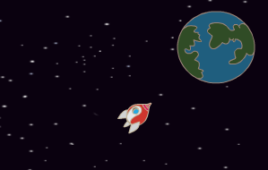

## Animiranje z uporabo zank

Drug način animiranja raket je, da se ji pove, da naj se velikokrat malo premakne

\--- task \--- Izbriši blok `drsi`{:class="block3motion"} iz tvoje kode. V ta namen povleci block iz območja kode in ga vrszi nazaj med posamične bloke kode.


```blocks3
ko kliknemo na zastavico
obrni se v smer (0)
pojdi na x:(-150) y:(-150)
reci [Pojdimo!] za (2) sekund
obrni se proti (Zemlja)

- drsi (1) sekund do x:(0) y:(0)
```

\--- /task \---

\--- task \--- Sedaj uporabi blok `ponovi`{:class="block3control"}, da premakneš raketo bižje Zemlji.


```blocks3
ko kliknemo na zastavico
obrni se v smer (0)
pojdi na x:(150) y:(150)
reci [Pojdimo!] za (2) sekund
obrni se proti (Zemlja)

+ponovi (200) krat
  pojdi (2) korakov
```

Preizkusi in shrani svojo kodo: Tvoja vesoljska ladja bi se morala premikati proti Zemlji na enak način kot prej, le da tokrat uporablja blok `ponovi`{:class="block3control"}.

\--- /task \---

\--- task \--- Sedaj dodaj tvoji raketi kodo, da bo figura tvoje rakete spreminjala barvo, ko se bo približevala Zemlji.

Uporabi ta blok:


```blocks3
ko kliknemo na zastavico
obrni se v smer (0)
pojdi na x:(150) y:(150)
reci [Pojdimo!] za (2) sekund
obrni se proti (Zemlja)
ponovi (200) krat
  pojdi (2) korakov

+  spremeni učinek [barva v] za (25)
```

Preizkusi in shrani svoj projekt.


\--- /task \---

\--- task \--- Ali lahko nardiš, da bo tvoja raketa postajala manjša, ko se bo bližala Zemlji?

\--- hints \---

\--- hint \---

Tvoja raketa bi morala na začetku imeti `100% velikost`{:class="blocklooks"}, potem pa mora `spremeniti velikost`{:class="blocklooks"} za majhen odstotek, vsakič ko se premakne.

\--- /hint \---

\--- hint \---

Svoji kodi boš moral dodati te bloke:


```blocks3
spremeni vellikost za (10)

nastavi velikost na (100) %
```

\--- /hint \---

\--- hint \---

Tvoja koda bi morala izgledati tako:


```blocks3
ko kliknemo na zastavico
nastavi velikost na (100)%
obrni se v smer (0)
pojdi na x:(150) y:(150)
reci [Pojdimo!] za (2) sekund
obrni se proti (Zemlja)
ponovi (200) krat
  pojdi (2) korakov
  spremeni učinek [barva v] za (25)

+  spremeni velikost za (-0.3)
```

\--- /hint \---

\--- /hints \---

\--- /task \---

Preizkusi in shrani kodo. Tvoja raketa bi se sedaj morala manjšati, ko se premika. Preizkusi svojo raketo **še drugič**. Je na začetku prave velikosti?

