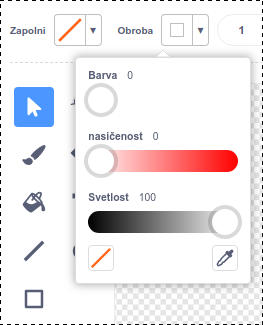
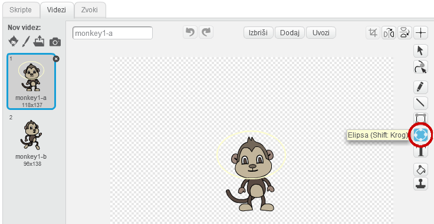

## Plavajoča opica

Sedaj boš svoji animaciji dodal še opico, ki je izgubljena v vesolju!

\--- task \--- Za začetek dodaj figuro 'monkey' iz knjižnice in jo preimenuj v 'opica'.


\--- /task \---

Klikni na to novo figuro opice, nato pa klikni na **Videzi**, da boš lahko spremminjal videz opice.

\--- task \--- Nastavi polnilo na prozorno, tako da izbereš rdečo črto. Za obrobo določi belo barvo s premikom drsnika za nasičenost na `0`.

 \--- /task \---

\--- task \--- Klikni na orodje **krog** in ga uporabi, da narišeš belo vesoljsko čelado okoli glave opice.



\--- /task \---

\--- task \--- Ali znaš figuri opice dodati kodo, da se počasi in neprenehoma vrti v krogu?

\--- hints \--- \--- hint \---

Ko **kliknemo na zeleno zastavo**, bi morala tvoja opica **ponavljati** v neskončnost **obračanje** v krogu.

\--- /hint \--- \--- hint \---

To so bloki kode, ki jih potrebuješ:

```blocks3
ponavljaj
konec

obrni se za (15) stopinj v desno
```

\--- /hint \--- \--- hint \---

Tukaj je koda, ki povzroči, da se tvoja opica vrti:


```blocks3
ko kliknemo na zastavico
ponavljaj
  obrni se za (1) stopinj v desno
```

\--- /hint \--- \--- /hints \---

\--- /task \---

Preizkusi in shrani svoj projekt. Če želiš to animacijo končati, klikni na rdeči gumb **končaj**, saj se bo sicer izvajala neprenehoma!

