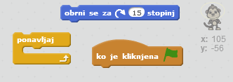
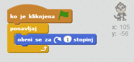

## Floating monkey

Dodajmo opico, ki se bo premikala v vesolju!

+ Začnite tako, da iz knjižnice dodate figuro 'monkey'.
    
    

+ Če kliknete na novo figuro 'monkey' in nato kliknite **Kostumi**, lahko uredite, kako bo opica izgledala. Kliknite orodje **elipsa** in narišite belo vesoljsko čelado okoli glave opice.
    
    

+ Ali lahko dodate program, da se bo opica vedno počasneje vrtela v krogu?
    
    Preizkusite in shranite svoj projekt. Če želite končati to animacijo, boste morali klikniti rdeči gumb **končaj**, saj se izvaja za vedno!
    
    

\--- hints \--- \--- hint \--- Ko kliknete **zeleno zastavico**, se mora opica ** za vedno** **obračati** v krogu. \--- /hint \--- \--- hint \--- Tukaj so bloki, ki jih potrebujete:  \--- /hint \--- \--- hint \--- Tukaj je koda, ki bo vašo opico obračala:  \--- /hint \--- \--- /hints \---