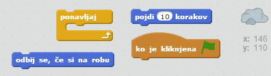
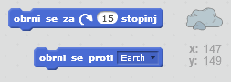
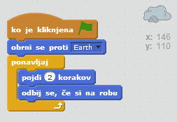

## 4. korak: Poskočni asteroid

Dodajte nekaj asteroidov v vašo animacijo.

+ V animacijo dodajte figuro 'rock'.
    
    

+ Lahko naredite, da se asteroid odbija po odru?
    
    

\--- hints \--- \--- hint \--- Ko kliknete **zeleno zastavo**, se mora asteroid **za vedno** **pomikati** in **odbijati** po odru. \--- /hint \--- \--- hint \--- Tukaj so bloki, ki jih potrebujete:  Naredite lahko tudi bolj zanimivo animacijo, z enim izmed naslednjih blokov:  \--- /hint \--- \--- hint \--- Tukaj je koda, ki bo naredila poskočni asteroid:  \--- /hint \--- \--- /hints \---