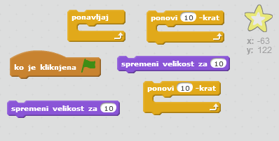
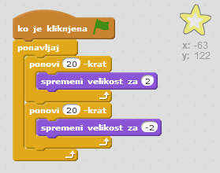

## Shining star

Združite zanke in ustvarite sijočo zvezdo.

+ V animacijo dodajte figuro 'star'.
    
    

+ Ali lahko kodo svojo zvezdo povečujete in zmanjšujete?
    
    

\--- hints \--- \--- hint \--- Ko kliknete **zeleno zastavico**, mora zvezda** spremeniti velikost**, tako da se večkrat poveča, nato pa nekoliko zmanjša. To morate narediti tako, da se bo večala in manjšala **za vedno**. \--- /hint \--- \--- hint \--- Tukaj so bloki, ki jih potrebujete:  \--- /hint \--- \--- hint \--- Tukaj je koda, s katero boste naredili sijočo zvezdo:  \--- /hint \--- \--- /hints \---