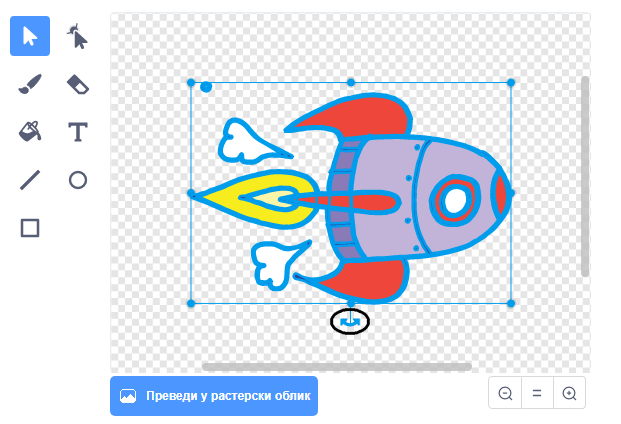

## Анимација свемирског брода

Твој први корак ће бити прављење свемирског брод који лети према Земљи!

\--- задатак \---

Отвори нови Скреч пројекат.

**На мрежи**: започни нови пројекат у Скреч уређивачу на мрежи на [rpf.io/scratch-new](http://rpf.io/scratchon){:target="_blank"}.

**Ван мреже:** започни нови пројекат на Скреч уређивачу ван мреже.

Ако је потребно да преузмеш и инсталираш Скреч уређивач ван мреже, можеш га пронаћи на [rpf.io/scratchoff](http://rpf.io/scratchoff){:target="_blank"}.

\--- /задатак \---

\--- task \---

Додај ликове 'свемирски брод' и 'Земља' на Позорницу.


[[[generic-scratch3-sprite-from-library]]]

\--- /task \---

\--- task \---

Додај позадину 'Звезде' на своју Позорницу.


\--- /task \---

\--- task \---

Кликни на лик свемирског брода, а затим кликни на картицу **Костими**.


\--- /задатак \---

\--- task \---

Use the **arrow** tool to click and drag a box around the whole spaceship image. Then click on the circular **rotate** handle, and rotate the image until it is on its side.



\--- /задатак \---

\--- task \---

Add this code to your spaceship sprite:


```blocks3
када је заставица кликнула
у правцу (0)
идите на к: (- 150) и: (- 150)
реците [Идемо] на (2) секунде
бода према (Еартх в)
глиде (1) сек. к: (0) и: (0)
```

Change the numbers in the code blocks you've added so that the code is exactly the same as above.

\--- /task \---

If you click the green flag, you should see the spaceship speak, turn, and glide towards the centre of the stage.

