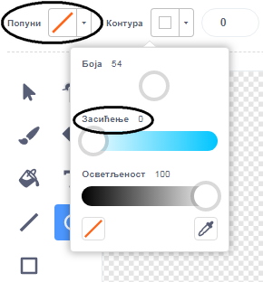
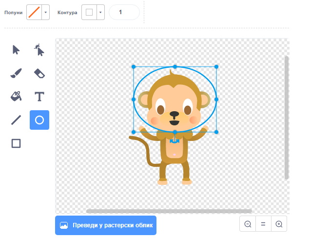

## Мајмун који плута

Сада ћеш својој анимацији додати мајмуна који се изгубио у свемиру!

\--- task \---

Почни тако што ћеш додати лик 'мајмуна' из библиотеке.


\--- /task \---

Кликни на новог лика мајмуна, а затим кликни на **Костими**, тако да можеш променити изглед мајмуна.

\--- task \---

Постави опцију 'Попуни' на транспарентно, тако што ћеш одабрати црвену линију. За контуру, постави белу боју, тако што ћеш померити клизач за Засићење на `0`.



\--- /задатак \---

\--- task \---

Кликни на алат **круг**, а затим га употреби да нацрташ белу свемирску кацигу око мајмунове главе.



\--- /task \---

\--- task \---

Можеш ли да додаш код лику мајмуна, тако да се заувек полако врти у круг?

\--- hints \--- \--- hint \---

Када је кликнуто на **зелену заставицу**, твој мајмун би требао да се **заувек** **окреће** у круг.

\--- /hint \--- \--- hint \---

Ево блокова кода који су ти потребни:

```blocks3
понављај заувек
end

окрет ↻ за (15) степени

када је кликнуто на ⚑
```

\--- /hint \--- \--- hint \---

Ево кода који ће направити да се твој мајмун окреће:


```blocks3
када је кликнуто на ⚑
понављај заувек 
  окрет ↻ за (1) степени
end
```

\--- /hint \--- \--- /hints \---

\--- /task \---

Испробај и сачувај свој пројекат. Мораћеш да кликнеш на црвено **заустави** дугме да зауставиш ову анимацију, јер се понавља заувек!

