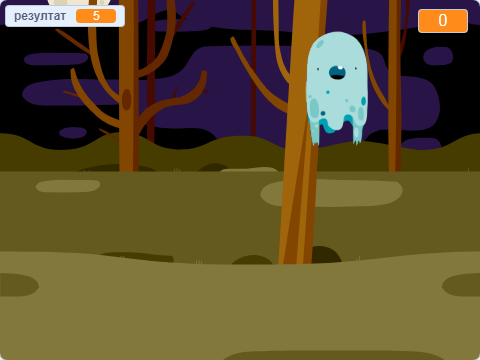

## Шта даље?

Испробај пројекат [Истеривачи духова](https://projects.raspberrypi.org/en/projects/ghostbusters?utm_source=pathway&utm_medium=whatnext&utm_campaign=projects)! У том ћеш пројекту научити како да креираш игре са духовима који се појављују свуда по месту и које мораш ухватити. Такође ћеш научити како да у игру додаш мерач времена и резултат, тако да можеш видети колико духова можеш да ухватиш.

\--- no-print \---

  <iframe allowtransparency="true" width="485" height="402" src="https://scratch.mit.edu/projects/embed/276874679/?autostart=false" frameborder="0" scrolling="no"></iframe>
  

\--- /no-print \---

\--- print-only \---

\--- /print-only \---