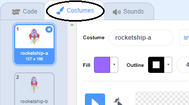

## ஒரு விண்கலத்தை அசைவூட்டல் செய்தல்

பூமியை நோக்கி பறக்கும் ஒரு விண்கலத்தை(spaceship) உருவாக்குவதே உங்கள் முதல் படி!

\--- பணி \---

ஒரு புதிய Scratch திட்டத்தைத் திறக்கவும்.

**நிகழ்நிலை (ஆன்லைன்):** ஒரு புதிய நிகழ்நிலை Scratch திட்டத்தை இங்கு [rpf.io/scratch-new](http://rpf.io/scratchon){:target ="_ blank"} திறக்கவும்.

**அகல்நிலை (ஆஃப்லைன்)**: அகல்நிலை பதிப்பானில் (ஆஃப்லைன் எடிட்டர்) ஒரு புதிய திட்டத்தை திறக்கவும்.

நீங்கள் Scratch அகல்நிலை பதிப்பானை பதிவிறக்கி நிறுவ வேண்டும் என்றால், அதை [rpf.io/scratchoff](http://rpf.io/scratchoff){:target="_blank"} இங்கு காணலாம்.

\--- /task \---

\--- task \---

உங்கள் மேடைக்கு(Stage) 'ராக்கெட்ஷிப்'(rocketship) மற்றும் 'பூமி'(Earth) sprite-களைச் சேர்க்கவும்.


[[[generic-scratch3-sprite-from-library]]]

\--- /task \---

\--- task \---

உங்கள் மேடைக்கு 'நட்சத்திரங்கள்'(Stars) பின்னணியைச் சேர்க்கவும்.


\--- /task \---

\--- task \---

உங்கள் விண்கலம் sprite-ஐக் கிளிக் செய்து, பின்னர், **Costumes** தத்தலைக்(tab) கிளிக் செய்க.



\--- /task \---

\--- task \---

முழு விண்கலம் படத்தைச் சுற்றி, ஒரு பெட்டியைக் கிளிக் செய்து இழுக்க **arrow** (அம்புக்குறி) கருவியைப் பயன்படுத்தவும். பின்னர் வட்ட **rotate** (சுழற்று) கைப்பிடியைக் கிளிக் செய்து, விண்கல படம் பக்கவாட்டுத் திசையில் வரும் வரை சுழற்றுங்கள்.


\--- /பணி \---

\--- பணி \---

உங்கள் விண்கல sprite-இல் இந்த குறியீட்டைச் சேர்க்கவும்:


```blocks3
when flag clicked
point in direction (0)
go to x:(-150) y:(-150)
say [Let's go] for (2) seconds
point towards (Earth v)
glide (1) secs to x:(0) y:(0)
```

நீங்கள் சேர்த்த குறியீட்டு தொகுதிகளில் உள்ள எண்களை மாற்றவும், இதனால் குறியீடு மேலே காட்டப்பட்டுள்ளதைப் போலவே இருக்க வேண்டும்.

\--- /task \---

நீங்கள் பச்சைக் கொடியைக் கிளிக் செய்தால், விண்கலம் பேசுவதையும், திரும்புவதையும், மேடையின் மையத்தை நோக்கிச் செல்வதையும் நீங்கள் காண வேண்டும்.

