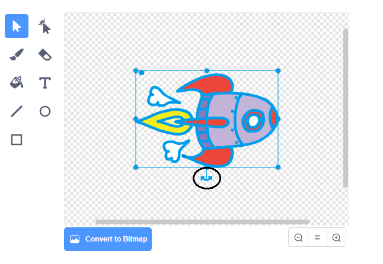

## ஒரு விண்கலத்தை அனிமேஷன் செய்தல்

பூமியை நோக்கி பறக்கும் ஒரு விண்கலத்தை உருவாக்குவதே உங்கள் முதல் படி!

\--- பணி \---

புதிய கீறல் திட்டத்தைத் திறக்கவும்.

**ஆன்லைன்:** ஒரு புதிய ஆன்லைன் கீறல் திட்டத்தை [rpf.io/scratch-new](http://rpf.io/scratchon)at இல் திறக்கவும்: target = "_ blank"}.

**ஆஃப்லைன்:** ஆஃப்லைன் எடிட்டரில் ஒரு புதிய திட்டத்தைத் திறக்கவும்.

நீங்கள் கீறல் ஆஃப்லைன் எடிட்டரை பதிவிறக்கி நிறுவ வேண்டும் என்றால், அதை [rpf.io/scratchoff](http://rpf.io/scratchoff)at: target = "_ blank" at இல் காணலாம்.

\--- /task \---

\--- task \---

உங்கள் நிலைக்கு 'ராக்கெட்ஷிப்' மற்றும் 'எர்த்' ஸ்ப்ரைட்டுகளைச் சேர்க்கவும்.


[[[generic-scratch3-sprite-from-library]]]

\--- /task \---

\--- task \---

உங்கள் நிலைக்கு 'நட்சத்திரங்கள்' பின்னணியைச் சேர்க்கவும்.


\--- /task \---

\--- task \---

உங்கள் விண்கலம் ஸ்பிரிட்டைக் கிளிக் செய்து, **ஆடைகள்** தாவலைக் கிளிக் செய்க.


\--- /task \---

\--- task \---

முழு விண்கலம் படத்தைச் சுற்றி ஒரு பெட்டியைக் கிளிக் செய்து இழுக்க **அம்பு** கருவியைப் பயன்படுத்தவும். பின்னர் வட்ட **சுழற்று** கைப்பிடியைக் கிளிக் செய்து, படத்தை அதன் பக்கத்தில் இருக்கும் வரை சுழற்றுங்கள்.



\--- /பணி \---

\--- பணி \---

உங்கள் விண்கல ஸ்பிரிட்டில் இந்த குறியீட்டைச் சேர்க்கவும்:


```blocks3
when flag clicked
point in direction (0)
go to x:(-150) y:(-150)
say [Let's go] for (2) seconds
point towards (Earth v)
glide (1) secs to x:(0) y:(0)
```

நீங்கள் சேர்த்த குறியீடு தொகுதிகளில் உள்ள எண்களை மாற்றவும், இதனால் குறியீடு மேலே உள்ளதைப் போலவே இருக்கும்.

\--- /task \---

நீங்கள் பச்சைக் கொடியைக் கிளிக் செய்தால், விண்கலம் பேசுவதையும், திரும்புவதையும், மேடையின் மையத்தை நோக்கிச் செல்வதையும் நீங்கள் காண வேண்டும்.

