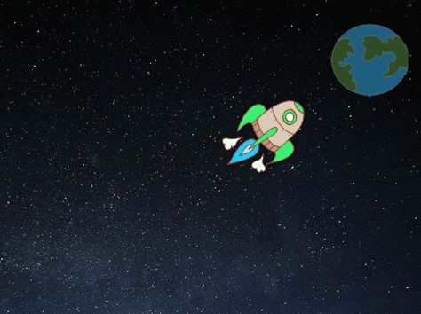

## சுழல்களைப் பயன்படுத்தி அனிமேஷன்

விண்கலத்தை உயிரூட்டுவதற்கான மற்றொரு வழி, ஒரு சிறிய தொகையை பல முறை நகர்த்தச் சொல்வது

\--- task \---

உங்கள் குறியீட்டிலிருந்து `சறுக்கு`{: class = "block3motion"} தொகுதியை நீக்கு. இதைச் செய்ய, கோட் பகுதியிலிருந்து தடுப்பை இழுத்து, மற்ற ஒற்றை குறியீடு தொகுதிகள் இருக்கும் இடத்திலேயே அதை கைவிடவும்.


```blocks3
when flag clicked
point in direction (0)
go to x:(-150) y:(-150)
say [Let's go] for (2) seconds
point towards (Earth v)

- glide (1) secs to x:(0) y:(0)
```

\--- /task \---

\--- task \---

இப்போது உங்கள் விண்கலத்தை பூமியை நோக்கி நகர்த்த `மீண்டும்`{: class = "block3control"} block ஐப் பயன்படுத்தலாமா?


```blocks3
when flag clicked
point in direction (0)
go to x:(-150) y:(-150)
say [Let's go] for (2) seconds
point towards (Earth v)

+ repeat (200)
    move (2) steps
```

உங்கள் குறியீட்டை சோதித்து சேமிக்கவும். உங்கள் விண்கலம் முன்பு போலவே பூமியை நோக்கி நகர வேண்டும், ஆனால் இந்த முறை அது `மீண்டும்`using ஐப் பயன்படுத்துகிறது: class = "block3control"} block.

\--- /task \---

\--- task \---

அடுத்து உங்கள் விண்கலம் ஸ்ப்ரைட்டுக்கு குறியீட்டைச் சேர்க்கவும், இதனால் விண்கலம் பூமியை நோக்கி நகரும்போது நிறத்தை மாற்றுமா?

இந்த தொகுதியைப் பயன்படுத்தவும்:


```blocks3
when flag clicked
point in direction (0)
go to x:(-150) y:(-150)
say [Let's go] for (2) seconds
point towards (Earth v)
repeat (200)
    move (2) steps

+    change [color v] effect by (25)
```

உங்கள் குறியீட்டை சோதித்து சேமிக்கவும்.


\--- /task \---

\--- task \---

உங்கள் விண்கலம் பூமியை நோக்கி நகரும்போது அதை சிறியதாக மாற்ற முடியுமா?

\--- hints \---

\--- hint \---

உங்கள் விண்கலம் `100% அளவு`{: class = "blocklooks" at இல் தொடங்க வேண்டும், பின்னர் `மாற்றம் அளவு`{: class = "blocklooks" every ஒவ்வொரு முறையும் நகரும் போது ஒரு சிறிய தொகையால்.

\--- /hint \---

\--- hint \---

உங்கள் தொகுதிக்கு இந்த தொகுதிகளை நீங்கள் சேர்க்க வேண்டும்:


```blocks3
change size by (10)

set size to (100) %
```

\--- /hint \---

\--- hint \---

உங்கள் குறியீடு இப்படி இருக்க வேண்டும்:


```blocks3
when flag clicked
set size to (100) %
point in direction (0)
go to x:(-150) y:(-150)
say [Let's go] for (2) seconds
point towards (Earth v)
repeat (200)
    move (2) steps
    change [color v] effect by (25)

+   change size by (-3)
```

\--- /hint \---

\--- /hints \---

\--- /task \---

உங்கள் குறியீட்டை சோதித்து சேமிக்கவும். உங்கள் விண்கலம் இப்போது நகரும்போது சிறியதாக இருக்க வேண்டும். உங்கள் விண்கலம் ஒரு சோதனை **இரண்டாவது முறையாக**. இது தொடங்கும் போது சரியான அளவுதானா?

