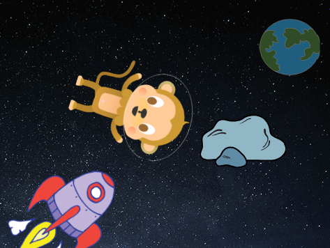

## துள்ளும் சிறுகோள்

இப்போது உங்கள் அசைவூட்டலில் மிதக்கும் விண்வெளி பாறையைச் சேர்ப்பீர்கள்.

\--- task \---

உங்கள் அசைவூட்டலில் 'பாறை'(rock) sprite-ஐச் சேர்க்கவும்.



\--- /task \---

\--- task \---

உங்கள் பாறையை, மேடையைச் சுற்றி துள்ளவைப்பதற்கான குறியீட்டை, உங்கள் பாறை sprite -இல் சேர்க்க முடியுமா?


\--- hints \--- \--- hint \---

பச்சைக் கொடியைக் கிளிக் செய்யும் போது(**flag is clicked**), உங்கள் பாறை sprite தொடர்ந்து எப்போதும்(**forever**) மேடையைச் சுற்றி நகர்ந்து(**move**) கொண்டும், துள்ளிக்(**bounce**) கொண்டும் இருக்க வேண்டும்.

\--- /hint \--- \--- hint \---

உங்களுக்கு தேவையான குறியீட்டு தொகுதிகள் இங்கே:

```blocks3
move (10) steps

if on edge bounce

when flag clicked

forever
```

நீங்கள் இந்த தொகுதிகளில் ஏதேனும் ஒன்றை வைத்து, பாறை sprite -இன் தொடக்க திசையை மேலும் சுவாரஸ்யமாக அமைக்கலாம்:

```blocks3
turn cw (15) degrees

point towards (Earth v)
```

\--- /hint \--- \--- hint \---

மேடையைச் சுற்றி உங்கள் பாறையை துள்ளச் செய்வதற்கான குறியீடு இங்கே:


```blocks3
when flag clicked
point towards (Earth v)
forever
    move (2) steps
    if on edge, bounce
```

\--- /hint \--- \--- /hints \--- \--- /task \---